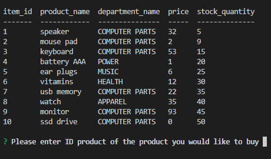
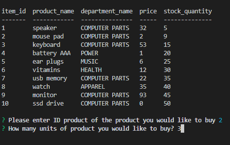
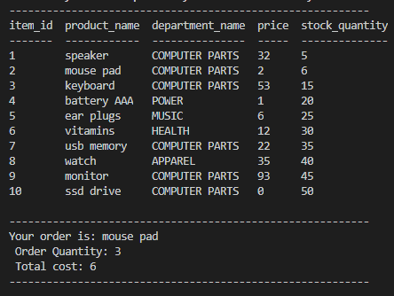

# **bamazon** Application

## The app take in orders from customers and deplete stock from the store's inventory. 

## Run instructions:

1. Open **bamazon.js** file and open this file in the terminal
2. Type **node bamazon.js** in the terminal and hit enter
3. You can see products table with the following columns:

   * item_id (unique id for each product)

   * product_name (Name of product)

   * department_name

   * price (cost to customer)

   * stock_quantity (how much of the product is available in stores)

4. Right under product table you need to answer for two following questions:

    * "Please enter ID product of the product you would like to buy" (choose any item_id you want to buy),
    * "How many units of product you would like to buy?" (type any integer number to get your order if your order quantity is bigger than stock quantity program gives to chance to consider you order)

5. If quantity of order will be smaller than stock quantity than stock quantity will be reduced by the number of purchase.

6. After placing the order, the updated table will be displayed along with a summary of the order

# **bamazon** demo:

## First output : Product table 

## Second output : Questions for user

## Final output: Updated product table with summary order

